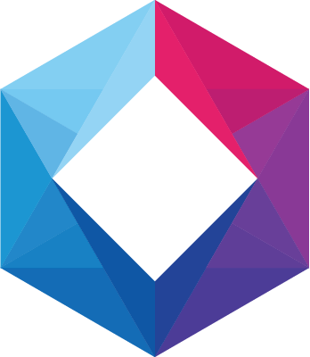

  

  
  

  ( 💻 Dev | Design 🎨 ) 

  { 💙 Flutter | Dart 🎯 }

  { 💾 TypeScript JS | HTML CSS 🖌 }

---

## 1. Summary

> Visit my website: [fanaro.io][fanaro.io]

I'm currently a solo developer creating apps and websites with Flutter, Dart, TypeScript, JavaScript, HTML and CSS. I also have experience with Docker, Python, Django, Kubernetes and some other stuff. However for most of these I would have to dust off my knowledge before fully using it back again.

> Currently, I've been studying a lot of Haskell and functional programming.

I'm a Brazilian native, so I speak Portuguese, but I also speak English and French.

> My daily driver is Artix, a distro based on Arch Linux, you can check out [my dotfiles][dotfiles]. I still have some software dependencies &mdash; addictions? &mdash; on Windows though, mostly due to working with others..

[dotfiles]: https://github.com/psygo/dotfiles

## 2. My Published/Open Software

So far, as published/open software, I have:

- [][fanaro.io] [fanaro.io][fanaro.io]: my blog, a place for UI/UX experimentation with the simplest and most effective designs for reading, and also for sharing my hopefully helpful world view.
  - The most prominent topics are: [Go][go_wikipedia], programming, productivity, design and psychology.
- [][youtube_kbd_nav] [YouTube Keyboard Navigation Extension][youtube_kbd_nav]: a browser extension which adds keyboard shortcuts to YouTube's browser UI.
  - Made with Dart 🎯
  - Quite stable, I use it on a daily basis. It still conflicts with some of YouTube's UI, but this problem is quite minimal.
  - Currently working with Chrome, Edge and Firefox, though full support for Firefox won't be maintained.
- [][ogs_kbd_nav] [OGS Keyboard Navigation Extension][ogs_kbd_nav]: a browser extension for playing go on [OGS][ogs] with only the keyboard.
  - Made with TypeScript.
  - It offers a way of navigating the online Goban with your arrow keys or typing in the coordinates.

[ogs]: https://online-go.com
[ogs_kbd_nav]: https://github.com/FanaroEngineering/ogs_kbd_nav
[youtube_kbd_nav]: https://github.com/FanaroEngineering/youtube_kbd_nav

## 3. Co-Authorship

- [][fast_immutable_collections] [Fast Immutable Collections][fast_immutable_collections]: Immutable collections for Dart, which are also faster than its competitors, like [kt_dart][kt_dart] and [built_collection][built_collection].
  - [@marcglasberg][marcglasberg] asked me if I wanted to participate in his project as a contributor. Almost all of the key ideas are his.
  - It features a benchmark app so you can compare it to its competitors.
  - [Here][fanaro.io_fic] is the article on my website.

[built_collection]: https://github.com/google/built_collection.dart
[fanaro.io_fic]: https://fanaro.io/articles/fic/fic.html
[fast_immutable_collections]: https://github.com/marcglasberg/fast_immutable_collections
[kt_dart]: https://github.com/passsy/kt.dart
[marcglasberg]: https://github.com/marcglasberg

## 4. Other Outlets

[][instagram]
[][twitter]
[][stackoverflow]
[][youtube]

 

[instagram]: https://www.instagram.com/fanaro009/
[fanaro.io]: https://fanaro.io/
[stackoverflow]: https://stackoverflow.com/users/4756173/philippe-fanaro?tab=profile
[twitter]: https://twitter.com/PFanaro
[youtube]: https://www.youtube.com/channel/UCuUK6AAtvo8cTFOJ3OOg9Mw?view_as=subscriber

## 5. My Competences

The ranking below follows the one typically seen in martial arts, like (Brazilian) Jiu Jitsu. Note that each level demands exponentially more skill, knowledge and experience.

> Don't take this too seriously: there's always a bigger fish.

<table align="center">
  <thead>
    <tr>
      <th>Competence</th>
      <th>Level (Belt)</th>
    </tr>
  </thead>
  <tbody>
    <tr>
      <td>Portuguese</td>
      <td>Black</td>
    </tr>
    <tr>
      <td>English</td>
      <td>Black</td>
    </tr>
    <tr>
      <td>Go</td>
      <td>Black</td>
    </tr>
    <tr>
      <td>Dart</td>
      <td>Black</td>
    </tr>
    <tr>
      <td>Markdown</td>
      <td>Black</td>
    </tr>
    <tr>
      <td>French</td>
      <td>Brown</td>
    </tr>
    <tr>
      <td>OOP</td>
      <td>Brown</td>
    </tr>
    <tr>
      <td>Flutter</td>
      <td>Brown</td>
    </tr>
    <tr>
      <td>Git</td>
      <td>Brown</td>
    </tr>
    <tr>
      <td>Python</td>
      <td>Brown</td>
    </tr>
    <tr>
      <td>VS Code</td>
      <td>Brown</td>
    </tr>
    <tr>
      <td>HTML</td>
      <td>Brown</td>
    </tr>
    <tr>
      <td>CSS</td>
      <td>Purple</td>
    </tr>
    <tr>
      <td>TypeScript</td>
      <td>Purple</td>
    </tr>
    <tr>
      <td>Linux</td>
      <td>Purple</td>
    </tr>
    <tr>
      <td>IntelliJ</td>
      <td>Purple</td>
    </tr>
    <tr>
      <td>SQL</td>
      <td>Purple</td>
    </tr>
    <tr>
      <td>NoSQL</td>
      <td>Purple</td>
    </tr>
    <tr>
      <td>Shell</td>
      <td>Purple</td>
    </tr>
    <tr>
      <td>Backgammon</td>
      <td>Purple</td>
    </tr>
    <tr>
      <td>Vim</td>
      <td>Purple</td>
    </tr>
    <tr>
      <td>Poker</td>
      <td>Purple</td>
    </tr>
    <tr>
      <td>Docker</td>
      <td>Purple</td>
    </tr>
    <tr>
      <td>JSON</td>
      <td>Purple</td>
    </tr>
    <tr>
      <td>YAML</td>
      <td>Blue</td>
    </tr>
    <tr>
      <td>Functional Programming</td>
      <td>Blue</td>
    </tr>
    <tr>
      <td>Haskell</td>
      <td>Blue</td>
    </tr>
    <tr>
      <td>JavaScript</td>
      <td>Blue</td>
    </tr>
    <tr>
      <td>Matlab</td>
      <td>Blue</td>
    </tr>
    <tr>
      <td>Blockchain</td>
      <td>Blue</td>
    </tr>
    <tr>
      <td>Kubernetes</td>
      <td>Blue</td>
    </tr>
    <tr>
      <td>Django</td>
      <td>Blue</td>
    </tr>
    <tr>
      <td>Structured Programming</td>
      <td>Blue</td>
    </tr>
    <tr>
      <td>Chinese</td>
      <td>White</td>
    </tr>
    <tr>
      <td>Korean</td>
      <td>White</td>
    </tr>
    <tr>
      <td>Chess</td>
      <td>White</td>
    </tr>
    <tr>
      <td>Jiu Jitsu</td>
      <td>White</td>
    </tr>
    <tr>
      <td>Emacs</td>
      <td>White</td>
    </tr>
    <tr>
      <td>C</td>
      <td>White</td>
    </tr>
    <tr>
      <td>Java</td>
      <td>White</td>
    </tr>
    <tr>
      <td>Raspberry Pi</td>
      <td>White</td>
    </tr>
  </tbody>
</table>

If you don't know anything about the belt system, here is a quick and dirty summary:

<table align="center">
  <thead>
    <tr>
      <th>Belt</th>
      <th>Explanation</th>
    </tr>
  </thead>
  <tbody>
    <tr>
      <td>White</td>
      <td>Padawan, first steps into the forest</td>
    </tr>
    <tr>
      <td>Blue</td>
      <td>Competent survivor</td>
    </tr>
    <tr>
      <td>Purple</td>
      <td>You have your own sharpened blade the way you like it</td>
    </tr>
    <tr>
      <td>Brown</td>
      <td>You can fight anyone, anywhere</td>
    </tr>
    <tr>
      <td>Black</td>
      <td>Complete master, can kill you with a plastic fork</td>
    </tr>
  </tbody>
</table>

## 6. Other Stuff

My interests are random and feature a wide variety of topics, something I've been unambiguously complimented on and criticized for. If you want to know more, do check my website out: [fanaro.io][fanaro.io].

Another major on-and-off interest of mine is in the game of ○● [Go][go_wikipedia] ●○ (Baduk or Weiqi (囲碁 or 바둑 or 围棋)). I have some articles about it in my website and have some videos on my YouTube channel as well &mdash; the videos are in Portuguese.

[go_wikipedia]: https://en.wikipedia.org/wiki/Go_(game)
